# <font size=8>游戲服務端</font>
* 集成式游戏平台，主打牌桌对局游戏,同时,涵盖市面上众多小游戏.
* 开发主旨，娱乐为主，快乐幸福至上！ 努力塑造无毒无赌的娱乐平台！

## <font size=5>游戏架构</font>
### <h3>游戏架构基于[go leaf](github.com/po2656233/goleaf).</h3>

游戏有房间概念，房间里包含桌位列表，而每个桌位仅与一个游戏绑定。
每个桌位可容乃多把椅子，而玩家都是在椅子上参与游戏的。


## <font size=5>游戏交互</font>

* 客户端通过已知游戏分类，获取游戏列表。(例如用户选择了对战类型，则返回所有对战类型游戏列表)
* 再通过选择的游戏，获取所有桌位。
* 选择某一桌位后，则由系统分配椅子。被分配了椅子的玩家则可以开始相关的游戏操作(诸如准备,摇色子,下注,出牌,弃牌等)。
* 每局游戏结束都会以积分(或金币)形式结算。

### <h3>编译指令</h3>
```
chmod -R 755 ./
```
```
CGO_ENABLED=1 GOOS=linux GOARCH=amd64 go build -o qpserver main.go
```


### <h3>数据库数据</h3>
在[conf/setting/server.json]中,配置好"dbUser"、"dbPassword"、"dbAddress"、"dbPort"、"dbName"。
1. 把 [gamedata/sqlData/minigame.sql]文件导入mysql数据库中;
2. 基于数据库minigame,可以新增的业务表,若无扩展业务可忽略。
```
go run ./tools/gen/genSqlModel.go 
```
注:其所生成数据库的model结构 被置[sql/model]目录下，相关model结构可用于业务制定和扩展。

### <h3>协议文件</h3>
 [msg/proto] 目录下统一放置与客户端交互的协议文件,执行以下批处理转换为go文件放置[msg/go]目录。
 <h6>windows</h6>
```windows
./tools/_generate.bat
```
<h6>linux</h6>
```linux
./tools/_generate.sh
```


##### <h6>非必要内容</h6>
客户端读写过大则出现 read message: websocket: close 1006 (abnormal closure): unexpected EOF
可根据如下改良leaf，再编译。
找到goleaf的ws_conn.go文件  修改ReadMsg
```
func (wsConn *WSConn) ReadMsg() ([]byte, error) {
    wsConn.conn.SetReadDeadline(time.Now().Add(35 * time.Second))// 加上
    _, b, err := wsConn.conn.ReadMessage()
    wsConn.conn.SetReadDeadline(time.Time{})// 加上
    return b, err
}
```

* * newWSConn函数内
```
// 加上
conn.SetWriteDeadline(time.Now().Add(60 * time.Second))
err := conn.WriteMessage(websocket.BinaryMessage, b)
if err != nil { break }
// 加上
conn.SetWriteDeadline(time.Time{})
```

# 郑重声明 <h6>赌博危害家庭，请远离各种形式的博彩活动。</h6>
# <font color=green size=8>适当娱乐，有益身心且丰富生活。</font>
# **<font color=red size=10>严禁借此参与赌博、圈外博弈等非法活动。否则，后果自负！</font> **


  

